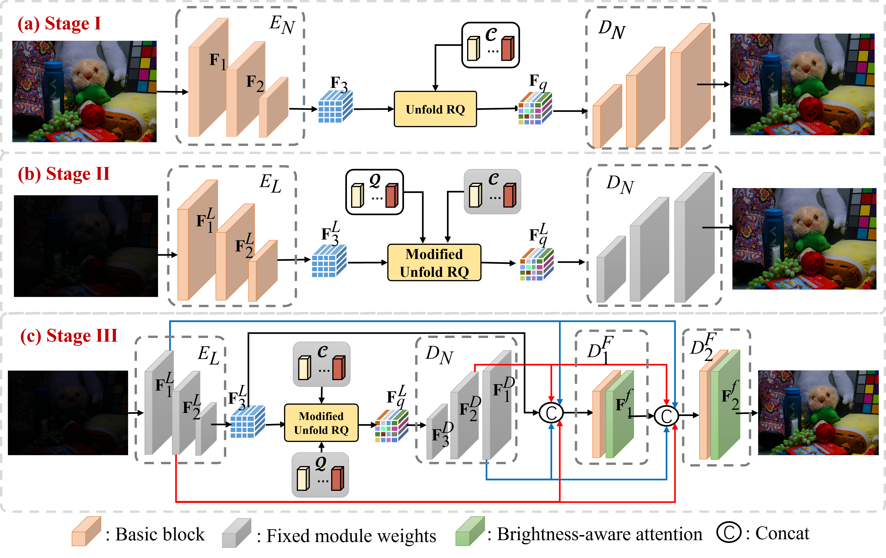

# Low-Light Image Enhancement with Multi-stage Residue Quantization and Brightness-aware Attention (ICCV2023)

This repository contains the Pytorch codes for paper **Low-Light Image Enhancement with Multi-stage Residue Quantization and Brightness-aware Attention (ICCV (2023))**. 
[[paper]](https://openaccess.thecvf.com/content/ICCV2023/papers/Liu_Low-Light_Image_Enhancement_with_Multi-Stage_Residue_Quantization_and_Brightness-Aware_Attention_ICCV_2023_paper.pdf)
---
## Overview
In this paper, we propose a brightness-aware network with normal-light priors based on brightness-aware attention and residualquantized codebook. To achieve a more natural and realistic enhancement, we design a query module to obtain more reliable normal-light features and fuse them with lowlight features by a fusion branch. In addition, we propose a brightness-aware attention module to further improve the robustness of the network to the brightness. Extensive experimental results on both real-captured and synthetic data show that our method outperforms existing state-of-the-art methods.


## Architecture

Figure 2: Architectures of the proposed three-stage framework for low-light image enhancement.

## Usage
### Download the RQ-LLIE repository
0. Requirements are Python 3 and PyTorch 1.8.0.
1. Download this repository via git
```
git clone https://github.com/LiuYunlong99/RQ-LLIE
```
or download the [zip file](https://github.com/LiuYunlong99/RQ-LLIE/archive/refs/heads/main.zip) manually.

### Prepare the Dataset
Download the following datasets:

LOLv1: [[Google Drive]](https://drive.google.com/drive/folders/1ncC-XWo9Fag8LfQ8RhiabZKar6kLrAI8?usp=drive_link)

LOLv2: [[Google Drive]](https://drive.google.com/drive/folders/11LW6jLvGHShnQIcQ_wxnUwg9oRKtmARj?usp=sharing)

### Evaluation

Download the pretrained models from [[Google Drive]](https://drive.google.com/drive/folders/1mFBjwejx1qlvILfiyzl1MQb4RjKAqyhx?usp=drive_link). And put them in the folder ___./pretrained_models___ .

```
# LOLv1
python test_LOLv1_v2_real.py -opt options/test/LOLv1.yml

# LOLv2-Real
python test_LOLv1_v2_real.py -opt options/test/LOLv2_real.yml

# LOLv2-Synthetic
python test_LOLv2_synthetic.py -opt options/test/LOLv2_synthetic.yml
```
Note you need to change the **dataroot_GT** and **dataroot_LQ** to your path in the option file.

### Training
Train the model on the corresponding dataset using the train config. For example, the training on LOLv1:
```
python -m torch.distributed.launch --nproc_per_node 1 --master_port 4320 train.py -opt options/train/LOLv1.yml --launcher pytorch
```

## Acknowledgements
This source code is inspired by [SNR(CVPR22)](https://github.com/dvlab-research/SNR-Aware-Low-Light-Enhance).

## Citation Information
If you find our work useful for your research, please consider giving this project a star and citing the following papers :)

```
@InProceedings{Liu_2023_ICCV,
    author    = {Liu, Yunlong and Huang, Tao and Dong, Weisheng and Wu, Fangfang and Li, Xin and Shi, Guangming},
    title     = {Low-Light Image Enhancement with Multi-Stage Residue Quantization and Brightness-Aware Attention},
    booktitle = {Proceedings of the IEEE/CVF International Conference on Computer Vision (ICCV)},
    month     = {October},
    year      = {2023},
    pages     = {12140-12149}
}
```
